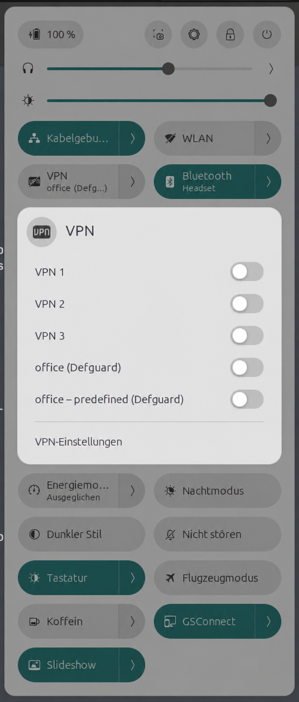
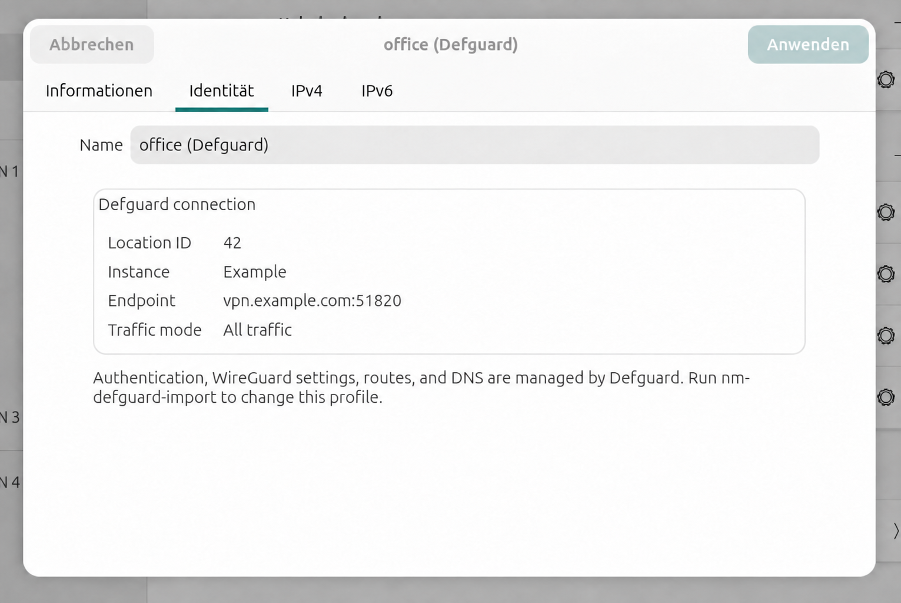

# NetworkManager Defguard plugin

Experimental NetworkManager frontend for VPN locations enrolled in Defguard
Desktop Client 2.1 or later. Imported locations appear beside other VPNs as
`<location> (Defguard)`, for example `office (Defguard)`.

NetworkManager owns the connection lifecycle, while Defguard continues to
handle browser SSO, WireGuard, routes, DNS, posture checks, and session keys.
Connecting from NetworkManager therefore opens the same authentication flow as
the Defguard app.

## Requirements

- Linux with NetworkManager and systemd
- Defguard Desktop Client 2.1 or later, already enrolled for the current user
- `defguard-client`, `runuser`, and `systemd-run`
- Go, a C compiler, `pkg-config`, and the libnm/GTK development headers (only
  to build from source)

On Debian or Ubuntu, install the native build dependencies with:

```sh
sudo apt-get install build-essential pkg-config libnm-dev libgtk-3-dev libgtk-4-dev
```

The Defguard system service must be running:

```sh
sudo systemctl enable --now defguard-service.service
```

The browser authentication flow also requires the enrolled user to have an
active desktop and user-systemd session. The Defguard GUI itself does not need
to remain open.

## Install a release

GitHub releases provide an amd64 Debian package containing the complete plugin,
including both settings editors. With Defguard Client already installed,
download the `.deb` and install it with:

```sh
sudo apt install ./network-manager-defguard_<version>_amd64.deb
nm-defguard-import --with-predefined
```

Each release also includes `SHA256SUMS`. Maintainers create a release by
pushing a semantic-version tag:

```sh
git tag v0.1.0
git push origin v0.1.0
```

GitHub Actions formats, lints, builds, tests, packages, and publishes the tag.
Homebrew is not used because this plugin is Linux-specific and installs native
NetworkManager, D-Bus, GTK3, and GTK4 components rather than a standalone Go
binary.

## Build and install

```sh
make test
make build
sudo make install
```

Run the same formatting, lint, test, and GitHub Actions security checks locally
with [prek](https://prek.j178.dev/):

```sh
prek run --all-files
prek install
```

The first command checks the whole repository; the second installs the checks
as a Git pre-commit hook. This includes `govulncheck` for reachable Go
vulnerabilities. Prek installs the pinned zizmor version automatically.

This installs:

- `/usr/libexec/nm-defguard-service`
- `/usr/libexec/nm-defguard-auth-dialog`
- `/usr/bin/nm-defguard-import`
- `/usr/lib/<architecture>/NetworkManager/libnm-vpn-plugin-defguard.so`
- `/usr/lib/<architecture>/NetworkManager/libnm-vpn-plugin-defguard-editor.so`
- `/usr/lib/<architecture>/NetworkManager/libnm-gtk4-vpn-plugin-defguard-editor.so`
- `/usr/lib/NetworkManager/VPN/nm-defguard-service.name`
- `/usr/share/dbus-1/system.d/nm-defguard-service.conf`

No plugin-specific systemd unit needs to be enabled. NetworkManager discovers
the `.name` file and launches `nm-defguard-service` on demand.

The GTK3 and GTK4 editor modules add a read-only Defguard section to compatible
NetworkManager settings applications. It shows the location ID, instance,
endpoint, and traffic mode. WireGuard details remain absent because Defguard,
not NetworkManager, owns the temporary WireGuard configuration.

The auth-dialog helper only tells desktop secret agents that this profile has
no NetworkManager-managed secrets. Defguard authentication still happens in
the browser during activation. Without this helper, GNOME Settings waits about
25 seconds for a secret request to time out before displaying the editor.

## Settings editor

Imported Defguard profiles appear alongside other VPN connections and can be
activated from the regular NetworkManager menu:



The **Identity** tab then shows the read-only Defguard details. WireGuard
settings are intentionally absent because Defguard downloads and manages the
temporary WireGuard configuration after authentication.



## Import Defguard locations

Run the importer as the normal desktop user who enrolled Defguard. Do **not**
use `sudo`; the importer reads that user's Defguard configuration and creates
user-restricted NetworkManager profiles.

Preview the profiles first, then import them:

```sh
nm-defguard-import --dry-run
nm-defguard-import
```

The regular profile explicitly routes all traffic through Defguard. To also
create a profile that routes only the location's predefined traffic, run:

```sh
nm-defguard-import --with-predefined
```

This creates two selectable profiles per location:

- `office (Defguard)` — all traffic (`defguard-client connect --all-traffic`)
- `office – predefined (Defguard)` — predefined traffic only
  (`defguard-client connect --predefined-traffic`)

Importing again refreshes existing profiles instead of duplicating them.
Profiles persist in NetworkManager, so rerun the importer only after Defguard
locations change. Running without `--with-predefined` does not delete a
previously imported predefined profile.

## Connect and disconnect

Use the desktop network menu like any other VPN. Selecting a Defguard profile
starts the browser SSO flow when authentication is required.

The equivalent command-line operations are:

```sh
nmcli connection up "office (Defguard)"
nmcli connection down "office (Defguard)"
```

Use `office – predefined (Defguard)` instead when only predefined traffic
should use the VPN.

Wait for browser authentication to finish before judging the `nmcli` command
as stalled. Closing or rejecting the browser flow causes activation to fail.

## Startup and automatic connection

There are two independent startup mechanisms:

1. `defguard-service.service` is enabled system-wide and starts at boot.
2. NetworkManager starts this plugin only when a Defguard profile is activated.

Nothing else needs autostart configuration. In particular, do not add the
plugin binary or Defguard GUI to desktop startup.

NetworkManager can mark a profile for automatic connection, but this is not
recommended for interactive OIDC: authentication needs a logged-in graphical
session and browser interaction. Connect from the network menu after login.

## Upgrade

Rebuild and replace the installed files:

```sh
make test
make build
sudo make install
nm-defguard-import
```

NetworkManager may keep an already-running copy of the old plugin binary. If a
profile is active, disconnect it first. Then stop the stale process; the next
connection attempt starts the newly installed binary:

```sh
nmcli connection down "office (Defguard)"
sudo pkill -f '^/usr/libexec/nm-defguard-service$'
```

## Troubleshooting

Check the required services and user session:

```sh
systemctl status NetworkManager.service
systemctl status defguard-service.service
systemctl --user status
```

Check whether NetworkManager and Defguard agree about connection state:

```sh
nmcli connection show --active
defguard-client status --json
```

Inspect an imported profile without printing stored secrets:

```sh
nmcli -g connection.id,connection.uuid,connection.permissions,vpn.service-type,vpn.data \
  connection show "office (Defguard)"
```

Avoid `nmcli --show-secrets` in logs or bug reports: it asks NetworkManager to
print secret-valued fields. This plugin does not intentionally store Defguard
credentials, but omitting that flag is the safer diagnostic default.

View plugin and NetworkManager logs with:

```sh
journalctl -u NetworkManager.service -b
journalctl --user -b
```

Common causes of failed activation are:

- `defguard-service.service` is not running;
- the command was started outside the enrolled user's desktop session;
- the browser authentication flow was cancelled or timed out;
- the importer was run with `sudo`, creating a profile for the wrong user; or
- an old plugin process is still running after an upgrade.

## Uninstall

Disconnect and optionally delete imported profiles, then remove the installed files
listed in the installation section:

```sh
nmcli connection down "office (Defguard)"
nmcli connection delete "office (Defguard)"
sudo rm /usr/libexec/nm-defguard-service \
  /usr/libexec/nm-defguard-auth-dialog \
  /usr/bin/nm-defguard-import \
  /usr/lib/NetworkManager/VPN/nm-defguard-service.name \
  /usr/share/dbus-1/system.d/nm-defguard-service.conf
sudo rm "$(pkg-config --variable=libdir libnm)/NetworkManager/libnm-vpn-plugin-defguard.so" \
  "$(pkg-config --variable=libdir libnm)/NetworkManager/libnm-vpn-plugin-defguard-editor.so" \
  "$(pkg-config --variable=libdir libnm)/NetworkManager/libnm-gtk4-vpn-plugin-defguard-editor.so"
```

Do not disable `defguard-service.service` if the regular Defguard app is still
in use.

## Current limitations

- Only one NetworkManager-managed Defguard connection can be active at a time.
- Defguard 2.1 status JSON does not include location IDs. Adopting an already
  active tunnel is ambiguous when multiple active locations share a name.
- Browser OIDC is supported; the plugin has no native dialogs for TOTP, email,
  or mobile approval flows.
- Removing a location from Defguard does not delete its imported NetworkManager
  profile automatically.

The full flow has been tested with NetworkManager 1.52, GNOME 49, and Defguard
Client 2.1.0: importing profiles, adopting an existing tunnel, browser SSO,
status reporting, and NetworkManager-driven disconnect all worked.
